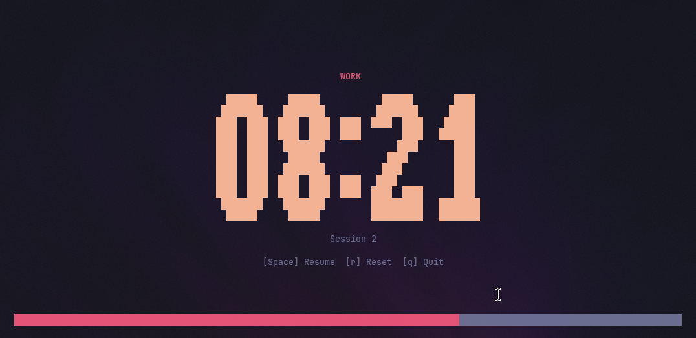

# tumodori

[](https://crates.io/crates/tumodori)
[](https://github.com/nandomoreirame/tumodori/actions)
[](LICENSE)
[](https://www.rust-lang.org/)
[](https://crates.io/crates/tumodori)
[](https://docs.rs/tumodori)

A terminal-based Pomodoro timer with big digit display, built with [Ratatui](https://ratatui.rs/) and Rust.



## Features

- Big, centered digit display for easy reading from a distance
- Configurable work, short break, and long break durations
- Automatic long break after a configurable number of sessions
- Desktop notifications with alarm sound when a phase ends
- Color-coded phases (red for work, green for short break, blue for long break)
- Color-coded timer states (gray idle, yellow paused, white finished)
- Progress bar at the bottom of the terminal
- Session counter

## Installation

### From crates.io

```bash
cargo install tumodori
```

### From source

```bash
git clone https://github.com/nandomoreirame/tumodori.git
cd tumodori
cargo install --path .
```

## Usage

```bash
tumodori
```

### Keybindings

| Key | Action |
|-----|--------|
| `Space` | Start / Pause / Resume / Next phase |
| `r` | Reset current timer |
| `s` | Skip to next phase |
| `q` / `Esc` | Quit |

### CLI options

| Flag | Short | Default | Range | Description |
|------|-------|---------|-------|-------------|
| `--work` | `-w` | 25 | 1-1440 | Work session duration in minutes |
| `--short-break` | `-s` | 5 | 1-1440 | Short break duration in minutes |
| `--long-break` | `-l` | 15 | 1-1440 | Long break duration in minutes |
| `--sessions` | `-n` | 4 | 1-100 | Work sessions before a long break |
| `--no-notify` | | | | Disable desktop notifications |

### Examples

```bash
tumodori                          # defaults (25/5/15, 4 sessions)
tumodori -w 50 -s 10 -l 20 -n 6  # custom durations
tumodori --no-notify              # disable notifications
```

## Audio notifications

When a phase ends, tumodori sends a desktop notification and plays an alarm sound using PipeWire (`pw-play`) or PulseAudio (`paplay`) as fallback. A terminal bell is also emitted.

On Linux, the alarm sound file is expected at:

```
/usr/share/sounds/freedesktop/stereo/alarm-clock-elapsed.oga
```

Install it with the `sound-theme-freedesktop` package (available on most distributions). To disable all notifications, use `--no-notify`.

## Inspired by

- [timr-tui](https://github.com/sectore/timr-tui) - TUI app for timers, built with Ratatui and Rust

## Contributing

See [CONTRIBUTING.md](CONTRIBUTING.md) for guidelines.

## License

[MIT](LICENSE)
